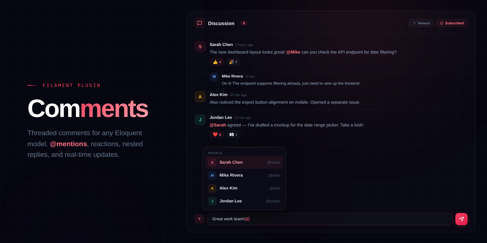

# Comments



A full-featured commenting system for Filament panels with threaded replies, @mentions, emoji reactions, and real-time updates.

[](https://packagist.org/packages/relaticle/comments)
[](https://packagist.org/packages/relaticle/comments)
[](https://php.net)
[](https://laravel.com)
[](https://github.com/relaticle/comments/actions)


## Features

- **Threaded Replies** - Nested comment threads with configurable depth limits
- **@Mentions** - Autocomplete user mentions with customizable resolver
- **Emoji Reactions** - 6 built-in reactions with configurable emoji sets
- **File Attachments** - Image and document uploads with validation
- **Notifications & Subscriptions** - Database and mail notifications with auto-subscribe
- **3 Filament Integrations** - Slide-over action, table action, and infolist entry


## Requirements

- **PHP:** 8.2+
- **Laravel:** 12+
- **Livewire:** 3.5+ / 4.x
- **Filament:** 4.x / 5.x


## Installation

```bash
composer require relaticle/comments
```

Publish and run migrations:

```bash
php artisan vendor:publish --tag=comments-migrations
php artisan migrate
```

## Usage

### Set Up Your Models

Add the commenting traits to your models:

```php
use Relaticle\Comments\Concerns\HasComments;
use Relaticle\Comments\Contracts\Commentable;

class Project extends Model implements Commentable
{
    use HasComments;
}
```

Add the commenter trait to your User model:

```php
use Relaticle\Comments\Concerns\IsCommenter;
use Relaticle\Comments\Contracts\Commenter;

class User extends Authenticatable implements Commenter
{
    use IsCommenter;
}
```

### Register the Filament Plugin

```php
use Relaticle\Comments\CommentsPlugin;

public function panel(Panel $panel): Panel
{
    return $panel
        ->plugins([
            CommentsPlugin::make(),
        ]);
}
```

### Add Comments to Your Resources

Use the slide-over action on view/edit pages:

```php
use Relaticle\Comments\Filament\Actions\CommentsAction;

protected function getHeaderActions(): array
{
    return [
        CommentsAction::make(),
    ];
}
```

Or add as a table action:

```php
use Relaticle\Comments\Filament\Actions\CommentsTableAction;

public static function table(Table $table): Table
{
    return $table
        ->actions([
            CommentsTableAction::make(),
        ]);
}
```

Or embed in an infolist:

```php
use Relaticle\Comments\Filament\Infolists\Components\CommentsEntry;

public static function infolist(Infolist $infolist): Infolist
{
    return $infolist->schema([
        CommentsEntry::make('comments'),
    ]);
}
```

**[View Complete Documentation ->](https://relaticle.github.io/comments/)**

## Our Ecosystem

<table>
<tr>
<td width="50%" valign="top">

### Custom Fields
[](https://relaticle.github.io/custom-fields)

Let users add custom fields to any model without code changes.
[Learn more ->](https://relaticle.github.io/custom-fields)

</td>
<td width="50%" valign="top">

### Flowforge
[](https://relaticle.github.io/flowforge)

Transform any Laravel model into a drag-and-drop Kanban board.
[Learn more ->](https://relaticle.github.io/flowforge)

</td>
</tr>
</table>

## Contributing

Contributions are welcome! Please feel free to submit a Pull Request.

## License

MIT License. See [LICENSE](LICENSE) for details.
